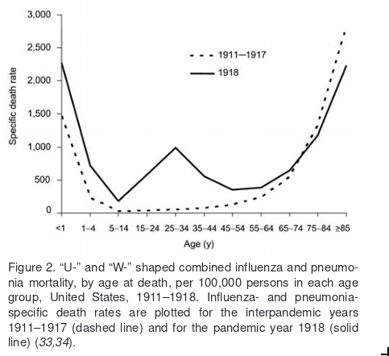
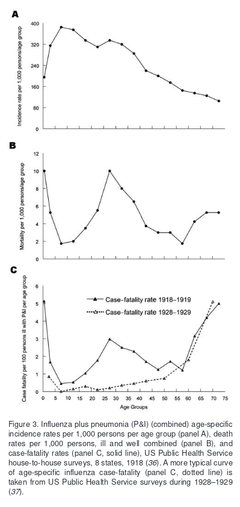

## Questions

1. What are are epidemics and how do they happen?
2. What can history teach us?
3. What data / statistical distribution do we have for impact per event?
4. What models can we use to understand them?
5. What different types are there and what significance does this have?
6. When and why do epidemics become panademics?

## Notes

**[Pandemics: A Very Short Introduction (Very Short Introductions), Christian W. McMillen (2016)](https://www.amazon.com/Pandemics-Very-Short-Introduction-Introductions-ebook-dp-B01N2LLMXE/dp/B01N2LLMXE/) (partial):**

Chapter on 1918 Influenza (Spanish flu):

- Impact: 1/3 of population got infected and ~50m died, happened in 3 waves of a few months each, 2nd most deadly
- Normal: Flu every season, pandemics come around every generation or so, this one especially bad
- Remote places: Remote places were hit, often worse, also quarantines were effective in e.g. American Samoa
- Quarantines: Arguably, quarantines has a long history and may have contributed to modern state, e.g. Italy 500 years ago, etc
- Hubris and censorship: UK not taking it seriously thinking they had germ theory of disease so all good, Italian gov censoring deaths
- Shapeshifter: Flu as shapeshifter, while we have progressed in some areas, in other same ignorance as 500y ago for pandemic influenza

Follow up questions:
- Is there less verbalistic and more data/statistics on remote places infection rate and quarantine effectiveness?
- More sources on connection between public health / quarantines and emergence of modern state? Similar to cities -> epidemics

**[An appraisal of the effectiveness of quarantines (1980)](https://www.annualreviews.org/doi/10.1146/annurev.py.18.090180.000505)**:

- Focus on plant quarantines and policy around that
- Quarantines come from Latin quarantum 40, which is the number of days a ship had to wait in harbour being people could disbark
- This should then be enough to ensure visitors didn't have latent diseases such as pest and cholera

Pretty clever, interesting with respective to mobility patterns and the inefficency. I wonder how widely this was adopted and who it applied to? 

Sources on [origins of quarantine (2002)](https://academic.oup.com/cid/article/35/9/1071/330421) with citations, a bit of a rabbit hole. 

**[1918 Influenza: the Mother of All Pandemics (2006)](https://www.ncbi.nlm.nih.gov/pmc/articles/PMC3291398/pdf/05-0979.pdf):**

- Case fatality for 1918 Influenza was >2.5%, compared to other influenza pandemics that were <0.1%
- The 1918 influenza, unlike almost all other influenza pandemics, showed a W-shape compared to a normal U-shape w.r.t age. I.e. it impacted young, old, and also half of cases were young adults 20-40
- We still don't understand a lot about origins or why it was so deadly, and a lot of strands after it (H/N etc) come from it

- Case fatality is proportion of cases (i.e. diagnosed, at a hospital say), divded by deaths. This is distinguished from mortality (full population) and incident ratio (diagnosed?).

Questions:
- What is the H/N etc numbers all about?
- What are some good hypotheses for why it was so deadly, and also specifically for young adults?

**[Infectious Disease Epidemiology: Theory and Practice, Kenrad E. Nelson, Carolyn Masters Williams (2010) [Standard textbook]](https://www.amazon.com/Infectious-Disease-Epidemiology-Theory-Practice/dp/1449683797/)**:

(Very) rough scope:

- Scope: Standard textbook with a lot of meat, most relevant now: *Part 2 Airborne Transmission Chapter 15 Epidemiology and Prevention of Influenza*, plus Part 1 with early history, general principles, prevention, outbreak epidemiology, dynamics, immune system, vaccines, etc.
- Early epidemiology: Hippocrates *Air, Water and Places* (400 BCE) origin of disease as science, distinguish between *endemic* (always present) vs *epidemic* (not always present, but sometimes in large numbers). Then a lot of stuff: need to read more carefully. Observation and care of patients. Connects this with statistics and surveillence. Discovery of microrganisms. Vaccines.
- General principles: Various forms of classification - infection (respiratory, CNS, etc); microbiological (bacterial, viral, parasite, etc); means of transmission (contact, food, airborne, etc); reservoir (human, animals, water). Characteristics - incubation period; biological such as infectivity/pathogenicity/virulence; Natural history (acute/chronic etc); surveillence of diseases
- Prevention: Handwash; food safety; sanitation etc. Outbreak tracking; cohort analysis. Dynamics: R0; SIR model; estimation methods. Geographical Information System (e.g. Cholera Snow). Microbiology tools.

Incubation period: time between exposure to infectious agent and onset of symptoms

Further reading:
- Early History of Infectious Disease Chapter 2 (Nelson 2010)
- General principles Chapter 2 (Nelson 2010), especially classification
- Chapter 6  Infectious Disease Dynamics (Nelson 2010, especially in conjunction with Mathematica/notebook etc

**Chapter 15 - Epidemiology and Prevention of Influenza Mark C. Steinhoff (Nelson, 2010):**

- Influenza annual ~300k deaths, often impacts 10-30% of populaton (=> 0.1% death rate) [attack rate = infection rate?]; "antigenic variants" means new strands come up a lot.
- Symptomps: abrupt onset of fever, respiratory symptoms, rhinorrhea, cough and sore throat. Transmission: respiratory secretion (cough/sneeze/talk); direct contact (kissing); indirect (nose-finger-doorknob).
- Nomenclature: difficult due to many strains, "shape shifter". In order: Virus type, geographic site of first id, strain number from lab, year of isolation, virus subtype (e.g. Influenza A). E.g. "Spanish 1918" is H1N1 etc. Different antigenic change - swine/avian/etc.
- Pandemic: pan = all; demos = people (greek). Five last 100y, vs annual influenza epidemics. Say case fatality rate of 1918 Spanish was 15-50% (!). First wave (April 18) it was reported as "low mortality" (how low?). Summer it changed, e.g. 10-25% of ppl died in Tahiti/western samoa.
- Recently re-created 1918 influenza in 2005 from permafrost soldier autopsy to study why so deadly.
- Normal influenza: usually happens abruptly, locally peaks in 3w and ends in 8w. North hemisphere (or NA?): Nov-Mar, Southern May-Sep (winter).
- Two metrics to describe transmission: Reproduction number R0 and generation/serial interval time. Reprodution number is _mean_ number of secondary cases for typical patients.
- Example transmissions: 1957/1968 1.5-1-8; 1918 2.4-5.4; 2009 1.8-2.2. Seasonal influenza serial interval time: 3.6; 2009 2.6-3.2.
- Varies in size and impact based on: (a) degree of antigenic variation (b) virulence and transmissability and (c) degree of protective immunity in population.
- Antigenic drift describes the mutability or "antigenic variation". This means e.g. changes surface of virus, and there's a high mutation chance in RNA, and high replication factor. The surface changes are "HA" and "NA" surfaces.
- History of last 100y pandemics shows age distribution, severity and transmission varies unpredictability.

Questions:
- What is an "antigenic variant"?
- What separate common cold, flu, influenza and other viruses?
- What is rhinorrhea?
- What is Influenza A vs other types?
  -- apparently it is more common and severe for pandemics vs type B and C
- What is meant by virulent? ~ more dangerous/fatal?
- How low was the case fatality of the first wave of the spanish flu?
- More precise mortality for spanish flu by region? Why?
- Why was case fatality so high for spanish flu? How does compare to other influenza pandemics?
- What is mean serial interval?
  -- Average time from symptom onset of primary case to that of secondary case. Time between successive cases.
- How can we know antigenic variant possibility for any given influenza?
- What is an antigen?
  -- In immunology, antigens are structures bound by antibodies, a cell surface receptor ~. [requires reading immunology chapter]
- Where can I find more data on case fatality for different pandemics?

## Further questions

### Specifically on nCov-2019 and related

- What exactly is corona virus?

On two differences vs SARS (according to Singapore PM):
- In what sense is it more infectious than SARS, and how do we know this?
- In what sense is it less fatal (case fatality or mortality?) than SARS? How do we know this? Claim: 10% for SARS vs mortality rate 0.2% [is this confusing mortality rate with case fatality?], compared with seasonal influenza 0.1%

## Further reading

- [Chapter 12, History of Influenza Pandemics, Bruno Lina (2008]([http://www.academia.dk/BiologiskAntropologi/Paleopatologi/PDF/Paleomicrobiology/12.pdf] from [Paleomicrobiology: Past Human Infections (2008)](http://www.academia.dk/BiologiskAntropologi/Paleopatologi/paleomicrobiology.php)

- [Chapter 1, Great Plagues of the Past and Remaining Questions (2008)](http://www.academia.dk/BiologiskAntropologi/Paleopatologi/PDF/Paleomicrobiology/01.pdf)

- [Pandemic Influenza's 500th Anniversary (2010)](https://academic.oup.com/cid/article/51/12/1442/317322)

- [Infectious Disease Epidemiology: Theory and Practice, Kenrad E. Nelson, Carolyn Masters Williams (2010) [Standard textbook]](https://www.amazon.com/Infectious-Disease-Epidemiology-Theory-Practice/dp/1449683797/)

- [Lessons from the History of Quarantine, from Plague to Influenza A, 2013](https://wwwnc.cdc.gov/eid/article/19/2/12-0312_article)

- [Estimates of the reproduction number for seasonal, pandemic, and zoonotic influenza: a systematic review of the literature (2014)](https://www.ncbi.nlm.nih.gov/pmc/articles/PMC4169819/)

- [On Airs, Waters, and Places, By Hippocrates, Written 400 B.C.E](http://classics.mit.edu//Hippocrates/airwatpl.html)
