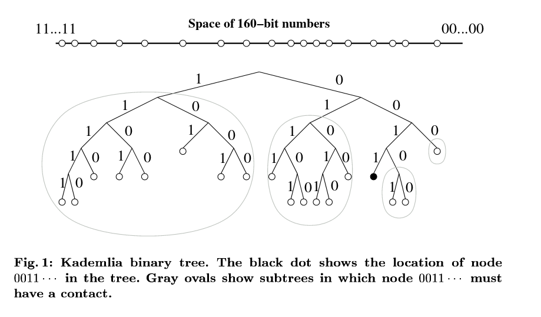
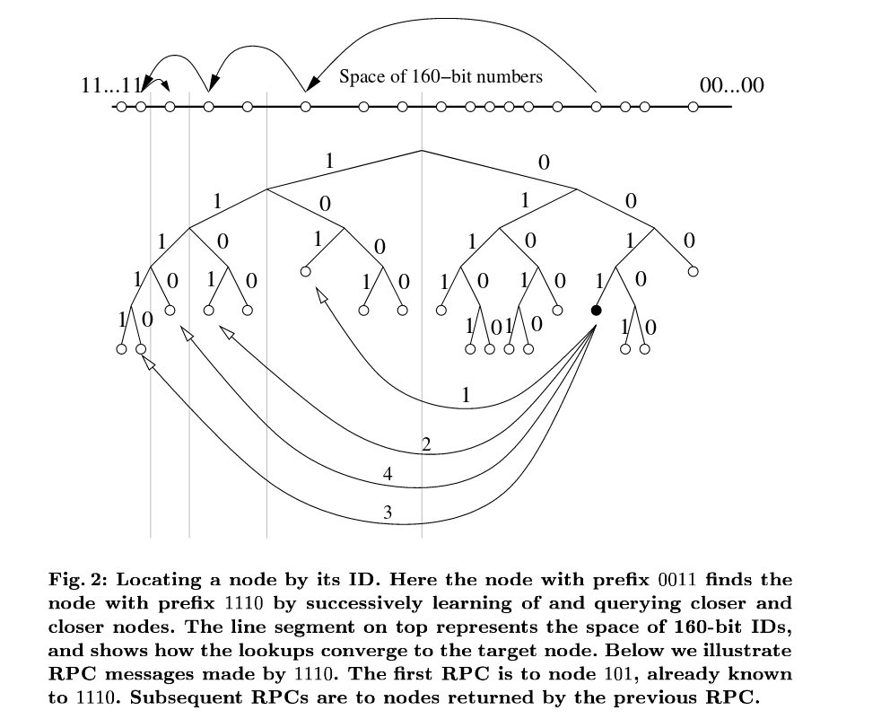
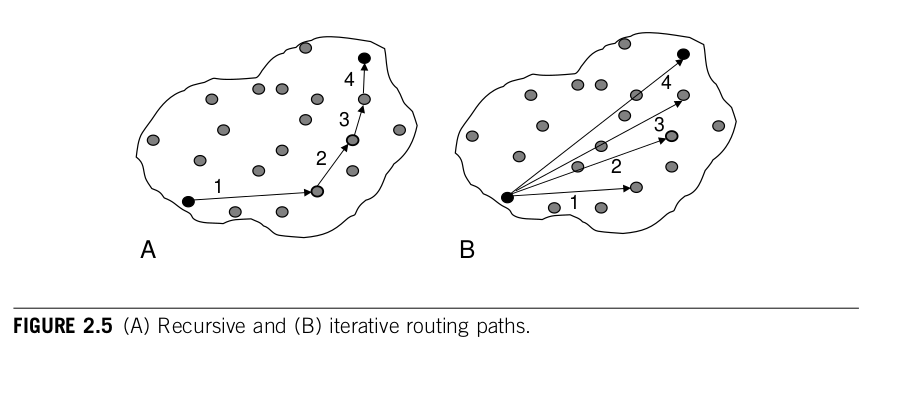

## Questions

1. How do we efficiently route content in a p2p network?
2. What are the trade-offs with respect to connectivity requirements, privacy, and so on?
3. How do various forms of relaying work?
4. What is the notion of "proof of trace" and where can we find it?

## Notes

**Kademlia: A peer-to-peer information system based on the xor metric (P Maymounkov, D Mazieres, 2002)** (https://pdos.csail.mit.edu/~petar/papers/maymounkov-kademlia-lncs.pdf):

- Distributed Hash Hable for P2P Networks that is efficient and provably consistent, using xor metric as distance metric.
- Each node, and key, has a 160-bit ID. These are stored in a Kademlia binary tree, where leaves are k-buckets of ids. Each node be connected to other subtrees to be able to reach the whole network.
- Nodes keep track of nodes and can cache data that is along its path. As a side effect of lookups, information about data location is also conveyed.
- Xor metric determines distance between two nodes, which allow us to get closer to our goal is lookup, O(logn).
- Each k-bucket acts as an LRU cache, and nodes uptime is lindy which is exploited by keeping old nodes around.
- The Kademlia protocol has 4 RPCs: `ping, store, find_node, find_value`

Further questions:
- What exactly is meant by provably consistent, given that it seems to be a probability based argument?
- Exactly what information is conveyed to whom in a lookup?
- How does Kademlia relate to Chord?

Illustration of Kademlia tree and connectivity (from paper):

Illustration of Kademlia path lookup (from paper):

*Landmark paper, need to study this further*

*Update: Currently working on my own implementation https://github.com/oskarth/nim-kad-dht and forked libp2p repo.*

Question:
- How 'official' of a concept is full kademlia connectivity? Where does Swarm talk about?
- What happens to full Kademlia connectivity if PeerID is really large, i.e. we have many k-buckets => many possible connections?

**P2P Networking and Applications (Chapter 2 P2P Concepts - Graph Theoretic Perspective, Buford, 2009)** (book):

- Using graph theoretical notation to analyze properties of p2p overlays, such as stability, convergence and boundary conditions (when properties break down). Allows analysis such as power laws, small world phenomena, connectivity etc.
- P2P overlay: G=(V,E), a graph of nodes with edges between them. Each node has neighbours and have a `pid` (peer id) and `nid` (network id). Overlay can be seen as a global view `G_i -> G_i+1`, etc, where each time step nodes join and leave the network.
- Routing table is local to each peer, and degree is number of neighbors a node has. A hop is from one peer to another. Routing path can be recursive (multistep) or iterative (get information then ask new node). Diameter of graph is worst case "distance" between two nodes.
- For storage retrieval we can additionally define `sid` and have an address space. This allows us to define predecessor and successor nodes in terms of id distance (e.g. Kademlia).

Illustration of recursive vs iterative routing (from book):

Follow-up questions:
- What are some good examples of this thinking allowing surprising and rigorous results that we can use?
- What does this look like in gossip networks? What about for Kademlia connectivity and churn / boundary conditions?

**[Epidemic algorithms for replicated database maintenance, Demers (1987)](https://www.cis.upenn.edu/~bcpierce/courses/dd/papers/demers-epidemic.pdf)**:

- Describes how maintain mutual consistency across multiple sites using different randomized algorithms
- Direct Mail - sent from one site to all sites, problem with not knowing all sites and mail lost
- Anti-entropy - choose another site at random and reconcile, reliable but slow
- Rumor mongering - start of ignorant, then spread hot rumor until it turns cold - corresponds to SIR model

Paper more about data consistency but randomized algorithms interesting as well for routing. Some simulation results regarding consistency and bandwidth overhead as well. Xerox Alto Research Center.

## Follow up questions:

- Who cited this paper?
- What did Demer do after?
- What are some good resources for Xerox PARC classics?

## Current reading list

Deep dive:
- [Kademlia: A Peer-to-peer Information System. Based on the XOR Metric. Petar Maymounkov 2002](https://pdos.csail.mit.edu/~petar/papers/maymounkov-kademlia-lncs.pdf) Deep dive in terms of gaining tactic knowledge by implementing it
- [Kademlia: A Design Specification, 2006 (?)](http://xlattice.sourceforge.net/components/protocol/kademlia/specs.html) More details on protocol

To skim:
- [S/Kademlia: A Practicable Approach Towards Secure Key-Based Routing (2007)](https://citeseerx.ist.psu.edu/viewdoc/download?doi=10.1.1.68.4986&rep=rep1&type=pdf) Extending Kademlia to be more secure
- [Epidemic Broadcast trees, 2007](https://repositorio.ul.pt/bitstream/10451/14105/1/07-14.pdf) Inspires episub in libp2p
- [HyParView: a membership protocol for reliable gossip-based broadcast, 2007](https://repositorio.ul.pt/bitstream/10455/2981/1/07-13.pdf) Inspires episub in libp2p
- [GoCast: Gossip-enhanced Overlay Multicast for Fast and Dependable Group Communication, 2005](https://citeseerx.ist.psu.edu/viewdoc/download?doi=10.1.1.75.4811&rep=rep1&type=pdf) Inspires episub in libp2p
- [A Border Gateway Protocol 4 (BGP-4), 2006](https://tools.ietf.org/html/rfc4271) IETF standard, used for general internet reading
- [Sloppy hashing and self-organizing clusters, 2003](https://www.coralcdn.org/docs/coral-iptps03.pdf) DHT extension

Recent, <10 years old:
- [Swarm forwarding kademlia, 2016 (?)](https://swarm-guide.readthedocs.io/en/latest/architecture.html#peer-management-hive-kademlia) Better understanding of forwarding Kademlia in Swarm

Very recent, <3y:
- libp2p 2018, half-life so-so https://github.com/libp2p/specs/blob/master/pubsub/gossipsub/episub.md
